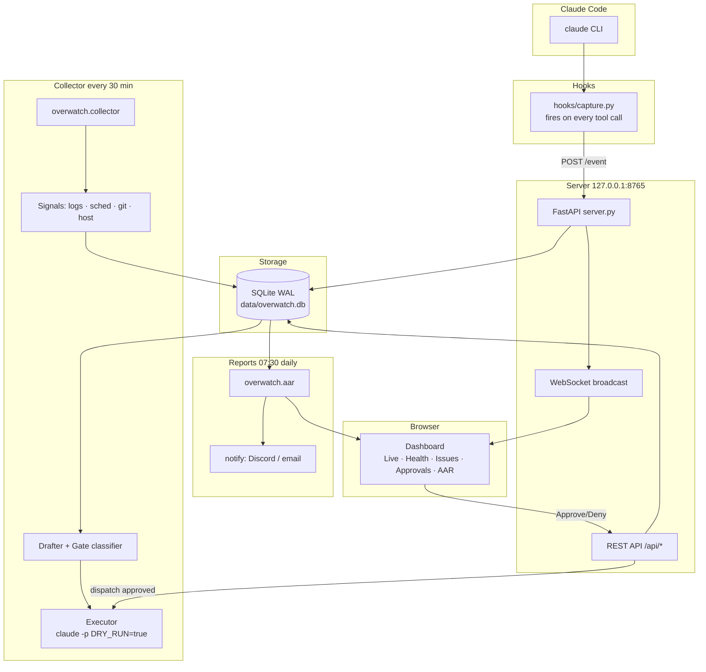

# cmd-overwatch

**Ops dashboard and self-healing agent for Claude Code automation fleets: health board, issue detection, gated remediation, daily after-action reports.**

[](https://github.com/ajelx64/cmd-overwatch/actions/workflows/ci.yml)
[](https://www.python.org/)
[](LICENSE)

---

## What it does

`cmd-overwatch` watches the machine running your Claude Code automation fleet and tells you
when something is wrong — and optionally fixes it. It streams every tool call from every
Claude Code session into a live browser dashboard, runs a scheduled collector every 30 minutes
to scan logs, git repos, Windows Task Scheduler, and host health for problems, and generates a
daily after-action report summarising what happened overnight.

Ungated fixes (log rotation, task restarts) execute automatically under strict rails. Anything
that could affect money, credentials, production branches, or external publishing waits in the
dashboard's **Approvals** queue until you click Approve or Deny.

---

## Features

**Live dashboard (5 tabs)**

- **Live** — real-time task kanban showing every active Claude Code session, plus a scrolling
  feed of every tool call (Read, Edit, Bash, Agent, …) with timing
- **Health** — per-project health tiles, host metrics (disk, backup recency), severity summary
- **Issues** — detected problems with severity, source, occurrence count, and current lifecycle
  state
- **Approvals** — pending gated remediation decisions with Approve / Deny controls
- **AAR** — daily after-action report viewer showing the most recent generated report

**Scheduled collector (every 30 min)**

- Log scanning — exit codes, Python tracebacks, ERROR/CRITICAL lines; staleness alerts for
  schedules that silently stopped
- Windows Task Scheduler health — missed runs, failure exit codes, stuck tasks
- Git hygiene — uncommitted changes older than 24 h, unpushed commits, stale branches
- Host health — disk space, Windows Event Log warnings, backup recency

**Gated executor**

- Auto-executes ungated fixes (log purge, restart) under strict rails: branch isolation,
  restricted tool allowlist, subprocess timeout + kill, single in-flight lock, `DRY_RUN=true`
  by default
- Gated categories (money, secrets, main-branch merges, deletions, auth/network, publishing,
  customer data, service installs) wait for explicit Approve before anything runs
- Every execution transcript is redacted before storage; a fix branch is the ceiling — merging
  is always a human step

**Daily after-action report (07:30)**

- Writes `reports/daily/YYYY-MM-DD-aar.md` with health board rollup, issues
  opened/resolved, pending approvals, execution transcripts, and log purge activity
- Optional Discord webhook or SMTP email delivery (off by default; credentials from env vars
  only)

---

## Architecture



The FastAPI server (`server.py`) is the hub. It accepts hook events from the `claude` CLI via
`POST /event`, persists them (redacted) to a WAL-mode SQLite database, and broadcasts them over
WebSocket to every connected browser. The collector (`overwatch.collector`) runs as a separate
scheduled process, writing issues and solutions to the same database. The dashboard reads
everything through the REST API and posts approval decisions back through it. The AAR generator
(`overwatch.aar`) reads the database and writes Markdown reports on a daily schedule.

Screenshots are in `docs/`.

---

## Prerequisites

- **Python 3.11+** (3.11 and 3.13 tested in CI)
- **Windows** recommended for the full feature set (Task Scheduler integration, Windows Event
  Log scanning). The server and collector are cross-platform; only the scheduler signals require
  Windows.
- The `claude` CLI on `PATH` — only required if you want the executor to run headless fixes

---

## Quickstart

```powershell
# 1. Clone the repo
git clone https://github.com/ajelx64/cmd-overwatch.git
cd cmd-overwatch

# 2. Install dependencies
pip install -r requirements.txt
# or, for development (includes ruff, mypy, pytest)
pip install -e ".[dev]"

# 3. Copy and edit the config
copy config.example.toml config.toml
# Edit config.toml — add your [[targets]] entries (see Configuration below).
# Leave dry_run = true until you have verified everything looks right.

# 4. Wire Claude Code hooks (one-time setup)
.\hooks\install.ps1

# 5. Start the dashboard server
.\start.ps1

# 6. Open the dashboard
# http://localhost:8765
```

The hook is non-blocking. If the server is not running, `capture.py` exits silently without
interrupting Claude Code.

**Smoke-test:** with the server running, send a test event:

```powershell
Invoke-RestMethod -Uri http://localhost:8765/event -Method POST `
    -ContentType "application/json" `
    -Body '{"phase":"pre","tool_name":"Read","tool_input":{"file_path":"test.py"},"tool_response":{}}'
```

You should see a row appear in the Live feed immediately.

---

## Configuration

Copy `config.example.toml` to `config.toml` (gitignored — your machine-specific paths never
reach the repository).

### Top-level keys

| Key | Type | Default | Description |
|-----|------|---------|-------------|
| `dry_run` | bool | `true` | Master safety switch. Nothing executes, purges, or sends until set to `false`. |
| `retention_days` | int | `30` | Days to keep log files before purge eligibility. |
| `data_dir` | string | `"data"` | SQLite database, transcripts, and executor worktrees. |
| `reports_dir` | string | `"reports"` | Daily AAR Markdown files. |
| `task_folders` | list of strings | `[]` | Windows Task Scheduler folders to health-check, e.g. `["\\MyAutomation\\"]`. |

### `[[targets]]` — watched projects

Each `[[targets]]` block is one project to monitor. Set `repo`, `log_dir`, or both.

| Key | Type | Required | Description |
|-----|------|----------|-------------|
| `name` | string | yes | Unique identifier for this project. |
| `repo` | path | no | Path to a git repository. Enables git hygiene checks. |
| `log_dir` | path | no | Directory to scan for log files. |
| `log_glob` | string | `"*.log"` | Glob pattern for log files inside `log_dir`. |
| `max_log_age_hours` | int | no | Raise an issue if the newest matching log is older than this. Useful for catching schedules that silently stopped. |

Example:

```toml
[[targets]]
name = "my-project"
repo = "C:/projects/my-project"
log_dir = "C:/projects/my-project/logs"
log_glob = "*.log"
max_log_age_hours = 25

[[targets]]
name = "nightly-jobs"
log_dir = "C:/automation/logs"
```

### `[server]`

| Key | Type | Default | Description |
|-----|------|---------|-------------|
| `host` | string | `"127.0.0.1"` | Bind address. Must be a loopback address (`127.0.0.1`, `localhost`, `::1`). The dashboard has no authentication and must never be exposed beyond this machine. |
| `port` | int | `8765` | Listening port. |

### `[gates]`

| Key | Type | Default | Description |
|-----|------|---------|-------------|
| `extra_patterns` | list of strings | `[]` | Additional regex patterns that force any solution into the approval queue. Built-in gate categories cannot be removed — only extended. |

Example:

```toml
[gates]
extra_patterns = ["deploy", "terraform"]
```

### `[notify]`

Notifications are off by default. Credentials come from environment variables, never from
`config.toml`.

| Key | Type | Default | Description |
|-----|------|---------|-------------|
| `discord` | bool | `false` | Enable Discord webhook. Set `OVERWATCH_DISCORD_WEBHOOK` env var. |
| `email` | bool | `false` | Enable SMTP email. Set `OVERWATCH_SMTP_PASSWORD` env var. |

`[notify.smtp]` sub-table:

| Key | Description |
|-----|-------------|
| `host` | SMTP server hostname. |
| `port` | SMTP port (default `587`). |
| `user` | SMTP username. |
| `from_addr` | Sender address. |
| `to_addr` | Recipient address. |

---

## Scheduler setup

Register the scheduled tasks with a single script:

```powershell
pwsh scheduler\Install-Schedule.ps1
```

This creates two Windows Task Scheduler tasks:

| Task | Schedule | What it does |
|------|----------|--------------|
| `\Overwatch\Collector` | Every 30 minutes | Runs `python -m overwatch.collector` — scans all four signal classes, upserts issues, drafts solutions, dispatches auto-eligible fixes |
| `\Overwatch\Daily AAR` | Daily at 07:30 | Runs `python -m overwatch.aar` — generates the after-action report and delivers notifications if configured |

To remove the tasks:

```powershell
pwsh scheduler\Uninstall-Schedule.ps1
```

---

## Running the collector manually

```powershell
# Full scan (all signal classes)
python -m overwatch.collector

# Scan only specific signal classes
python -m overwatch.collector --only logs git

# Force dry-run regardless of config.toml setting
python -m overwatch.collector --dry-run
```

Available signal class names: `logs`, `sched`, `git`, `host`.

---

## Running the AAR manually

```powershell
# Generate today's report
python -m overwatch.aar

# Generate a report for a specific date
python -m overwatch.aar --date 2025-01-15

# Generate and deliver notifications (obeys notify.discord / notify.email in config.toml)
python -m overwatch.aar --notify
```

Output is written to `reports/daily/YYYY-MM-DD-aar.md` and the path is printed to stdout.

---

## Safety and dry-run mode

`dry_run = true` is the default in `config.example.toml` and in the code. Every subsystem
that can take real action checks this flag:

| Subsystem | Dry-run behaviour |
|-----------|------------------|
| **Executor** | Builds the planned `claude -p` command and writes it to a transcript file, but never spawns the subprocess. |
| **Log purge** | Reports which files would be deleted and how many bytes would be freed, but deletes nothing. |
| **Notifications** | Builds and logs the full payload that would be sent, but makes no outbound requests. |

To enable live action, set `dry_run = false` in your `config.toml`. This is intentionally
not a CLI flag — it should be a deliberate edit, not an accident.

---

## Development

```powershell
# Create and activate a virtual environment
python -m venv .venv
.\.venv\Scripts\Activate.ps1

# Install with dev extras
pip install -e ".[dev]"

# Copy config
copy config.example.toml config.toml

# Run tests
python -m pytest

# Lint
ruff check .

# Type-check
python -m mypy overwatch/
```

CI runs `ruff`, `mypy`, `python -m compileall`, and `pytest` on Python 3.11 and 3.13.

---

## License

[MIT](LICENSE)
